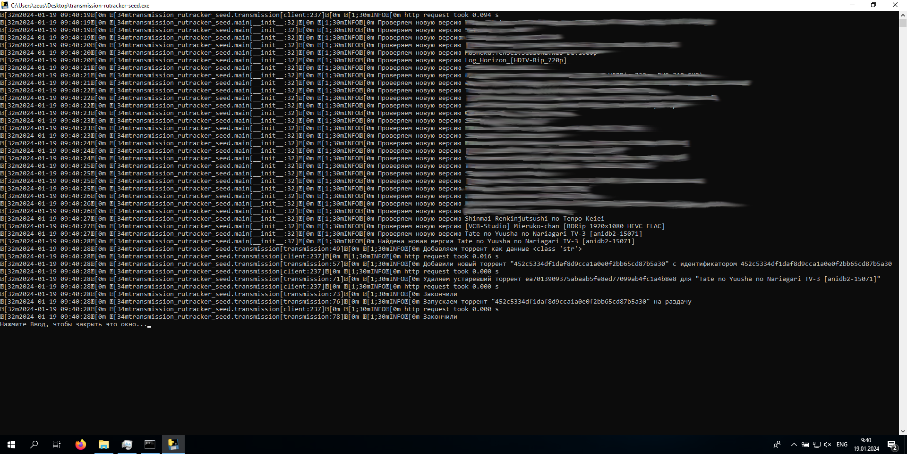
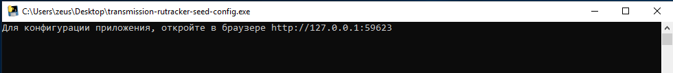
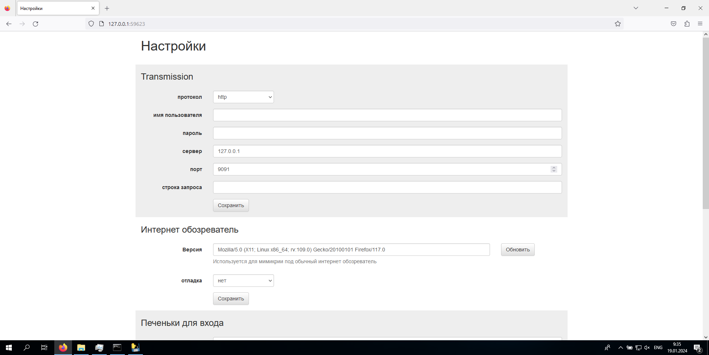

# About

transmission_rutracker_seed enables you to track updates of a torrent files published on 
[RuTrackerOrg](https://rutracker.org/forum/). It updates your torrent client with a new version of 
a torrent file which you are seeding.

So far, transmission_rutracker_seed supports [Transmission](https://transmissionbt.com/) version 4.0 and higher.

# Installation

### Prebuilt binaries

Binaries can be found on [Releases](https://github.com/abriel/transmission-rutracker-seed/releases) page.

### From sources for Linux

* Install Python, version 3.11 or higher.

* Initialise virtual environment
```
python -m venv venv/release
```

* Install python dependencies
```
python -m pip install -r requirements.release.txt
```

* Install other dependencies from a system packages, e.g.
```
sudo apt-get install gettext make
```

* Build binaries
```
make build
```

* Find binaries in `dist/linux/`

### From sources for Windows (under Linux)

* Install wine

* Install Python under wine, version 3.11 or higher. Create a symlink `.wine` -> `/home/$USER/.wine`

* Download and extract [upx](https://github.com/upx/upx/releases) into `.wine/drive_c/upx/`

* Install other dependencies from a system packages, e.g.
```
sudo apt-get install gettext make
```

* Build binaries
```
make build-win
```

* Find binaries in `dist/win/`

# Usage

Having a Transmission client on your laptop and running the `transmission-rutracker-seed` is piece of cake. 
By default, the program connects to Transmission client on local machine and scans RuTrackerOrg as anonymous. 

transmission-rutracker-seed replicates a tracker details required to send Seeding statistics from previous version of a torrent file.

The program supports English and Russian languages for now.



# Configuration

In case you want to play with configuration, run `transmission-rutracker-seed-config` which gives you Browser-like interface.

To interact with RuTrackerOrg as registered user, you can copy appropriate cookies from your browser.





# Frequent Questions

# Resources
